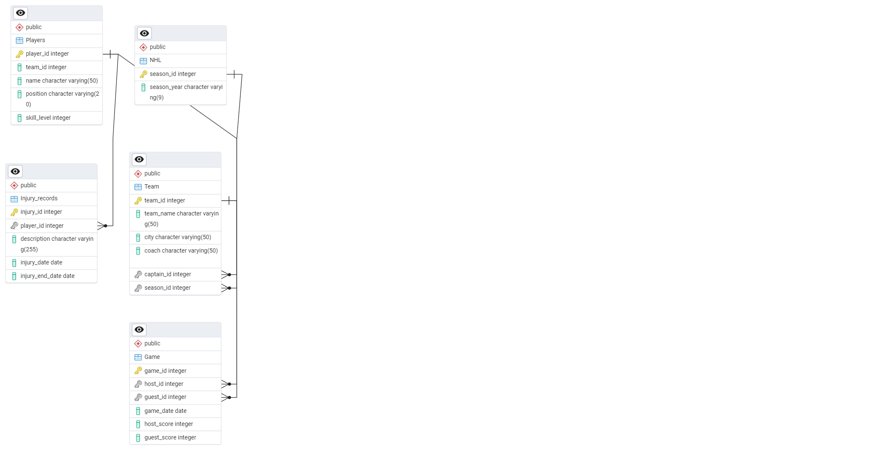

# NHL Database Project

This project sets up a PostgreSQL database for managing data related to the National Hockey League (NHL). It includes tables for tracking teams, players, games, injuries, and seasons. The database is structured to allow easy querying of team statistics, player injuries, game scores, and season information.

## Database Structure

The following tables are included in the database:

- **NHL**: Stores season information.
  - Columns: `season_id` (INT, Primary Key), `season_year` (VARCHAR)

- **Team**: Stores team information.
  - Columns: `team_id` (INT, Primary Key), `team_name` (VARCHAR), `city` (VARCHAR), `coach` (VARCHAR), `captain_id` (INT, Foreign Key referencing `Players.player_id`), `season_id` (INT, Foreign Key referencing `NHL.season_id`)

- **Players**: Stores player information.
  - Columns: `player_id` (INT, Primary Key), `team_id` (INT, Foreign Key referencing `Team.team_id`), `name` (VARCHAR), `position` (VARCHAR), `skill_level` (INT)

- **Game**: Stores game information.
  - Columns: `game_id` (INT, Primary Key), `host_id` (INT, Foreign Key referencing `Team.team_id`), `guest_id` (INT, Foreign Key referencing `Team.team_id`), `game_date` (DATE), `host_score` (INT), `guest_score` (INT)

- **Injury_records**: Stores player injury records.
  - Columns: `injury_id` (INT, Primary Key), `player_id` (INT, Foreign Key referencing `Players.player_id`), `description` (VARCHAR), `injury_date` (DATE), `injury_end_date` (DATE, optional)

## Screenshot

## Contributors
- [Omer Ozzy Akben](https://github.com/omerakben)

## Contact
- [LinkedIn](https://www.linkedin.com/in/omerakben/)